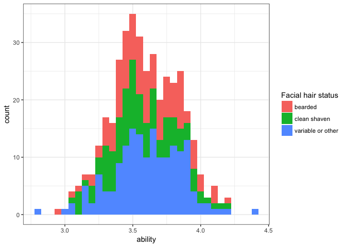
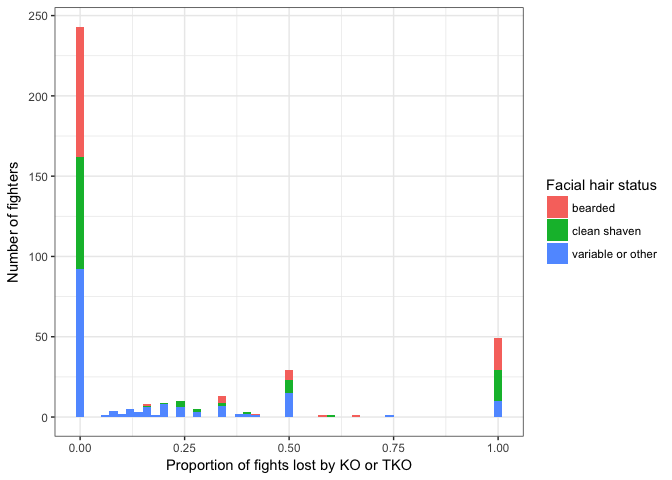

Beards in UFC
================

A Bradley-Terry analysis of the effect (or lack thereof) of beards on UFC wins, losses, and knock-outs.
-------------------------------------------------------------------------------------------------------

First load the libraries that we are using. Install first from CRAN if necessary.

``` r
library(BradleyTerry2)
library(dplyr)
```

    ## Warning: package 'dplyr' was built under R version 3.4.1

``` r
library(knitr)
library(ggplot2)
source("functions_for_prepping_bt_analysis.R")
```

Then load the data. Note the as.is thing which leaves all the character vectors as strings and does not make them into factors. This turns out to be important.

``` r
winner <- read.csv("data/UFC_winner.csv", as.is=T)
loser <- read.csv("data/UFC_loser.csv", as.is=T)
predictors <- read.csv("data/UFC_predictors.csv", as.is=T)
```

Delete fighters with only one fight which are making BT model fitting go crazy. Also recode some of the very rare stance types to "other" also helps the model converge.

``` r
winner <- winner[c(-18,-157),]
loser <- loser[c(-18,-157),]
predictors <- predictors[c(-6,-162),]
predictors$stance[predictors$stance==""] <- "other"
predictors$stance[predictors$stance=="Open Stance "] <- "other"
predictors$stance[predictors$stance=="Switch "] <- "other"
```

Turns out that the BradleyTerry model formation needs a very specific format to match things up so we label all the unique id columns "ID" and sort the predictor unique ID column to match the order of the levels of the trial-level files. This is all now done in an external function. If curious, investigate the R-script that is sourced at the top of this knitr document.

``` r
beards <- set_up_btm(predictors, winner, loser)
```

Run the main model

``` r
model1<-BTm(player1=winner,player2=loser,
            formula = ~ prev + as.factor(facehair) + ht[ID] + reach[ID] +   
              (1|ID), id="ID",data=beards)

summary(model1)
```

    ## 
    ## Call:
    ## 
    ## BTm(player1 = winner, player2 = loser, formula = ~prev + as.factor(facehair) + 
    ##     ht[ID] + reach[ID] + (1 | ID), id = "ID", data = beards)
    ## 
    ## Fixed Effects:
    ##                       Estimate Std. Error z value Pr(>|z|)  
    ## prev                  0.002166   0.119947   0.018   0.9856  
    ## as.factor(facehair)2 -0.027848   0.152367  -0.183   0.8550  
    ## as.factor(facehair)3 -0.044360   0.202270  -0.219   0.8264  
    ## ht[ID]               -0.044150   0.052307  -0.844   0.3986  
    ## reach[ID]             0.092260   0.036438   2.532   0.0113 *
    ## ---
    ## Signif. codes:  0 '***' 0.001 '**' 0.01 '*' 0.05 '.' 0.1 ' ' 1
    ## 
    ## (Dispersion parameter for binomial family taken to be 1)
    ## 
    ## Random Effects:
    ##           Estimate Std. Error z value Pr(>|z|)    
    ## Std. Dev.   0.5087     0.1000   5.087 3.63e-07 ***
    ## ---
    ## Signif. codes:  0 '***' 0.001 '**' 0.01 '*' 0.05 '.' 0.1 ' ' 1
    ## 
    ## 2 observations deleted due to missingness
    ## 
    ## Number of iterations: 15

See if stance matters

``` r
model2<-BTm(player1=winner,player2=loser,
            formula = ~ prev + as.factor(facehair)  + ht[ID] + reach[ID] + stance[ID] + (1|ID), id="ID",data=beards)

summary(model2)
```

    ## 
    ## Call:
    ## 
    ## BTm(player1 = winner, player2 = loser, formula = ~prev + as.factor(facehair) + 
    ##     ht[ID] + reach[ID] + stance[ID] + (1 | ID), id = "ID", data = beards)
    ## 
    ## Fixed Effects:
    ##                      Estimate Std. Error z value Pr(>|z|)   
    ## prev                 -0.01494    0.12117  -0.123  0.90184   
    ## as.factor(facehair)2 -0.03402    0.15488  -0.220  0.82612   
    ## as.factor(facehair)3 -0.05933    0.20689  -0.287  0.77430   
    ## ht[ID]               -0.05748    0.05319  -1.081  0.27988   
    ## reach[ID]             0.09877    0.03704   2.666  0.00767 **
    ## stance[ID]other      -1.08387    0.43055  -2.517  0.01182 * 
    ## stance[ID]Southpaw    0.27117    0.16968   1.598  0.11003   
    ## ---
    ## Signif. codes:  0 '***' 0.001 '**' 0.01 '*' 0.05 '.' 0.1 ' ' 1
    ## 
    ## (Dispersion parameter for binomial family taken to be 1)
    ## 
    ## Random Effects:
    ##           Estimate Std. Error z value Pr(>|z|)    
    ## Std. Dev.   0.5199     0.1010   5.145 2.67e-07 ***
    ## ---
    ## Signif. codes:  0 '***' 0.001 '**' 0.01 '*' 0.05 '.' 0.1 ' ' 1
    ## 
    ## 2 observations deleted due to missingness
    ## 
    ## Number of iterations: 15

Does this result depend on the type of victory?

2 or less is a TKO or KO

Greater than 3 is submission or decision or some other outcome. Here we split the dataset into those two categories and show that facial hair still does not have an effect.

Warning: code gets messy below here to again set up the data for the `BTm` function.

``` r
#other wins including decisions and submissions
w1<-subset(winner,winner$method>=3)
w1$ID<-as.factor(as.character(w1$ID))
l1<-subset(loser,loser$method>=3)
l1$ID<-as.factor(as.character(l1$ID))
p1<-subset(predictors,predictors$ID%in%c(as.character(w1$ID),as.character(l1$ID)))
b.out<-set_up_btm(p1,w1,l1)

model.other.outcomes<-BTm(player1=winner,player2=loser,
                          formula = ~  as.factor(facehair)  + reach[ID] + 
                            (1|ID), id="ID",data=b.out)
summary(model.other.outcomes)
```

    ## 
    ## Call:
    ## 
    ## BTm(player1 = winner, player2 = loser, formula = ~as.factor(facehair) + 
    ##     reach[ID] + (1 | ID), id = "ID", data = b.out)
    ## 
    ## Fixed Effects:
    ##                      Estimate Std. Error z value Pr(>|z|)
    ## as.factor(facehair)2 -0.04916    0.17886  -0.275    0.783
    ## as.factor(facehair)3 -0.31051    0.23927  -1.298    0.194
    ## reach[ID]            -0.01297    0.01953  -0.664    0.507
    ## 
    ## (Dispersion parameter for binomial family taken to be 1)
    ## 
    ## Random Effects:
    ##           Estimate Std. Error z value Pr(>|z|)    
    ## Std. Dev.   0.4831     0.1301   3.713 0.000205 ***
    ## ---
    ## Signif. codes:  0 '***' 0.001 '**' 0.01 '*' 0.05 '.' 0.1 ' ' 1
    ## 
    ## Number of iterations: 8

Investigating TKO's and KO's
----------------------------

``` r
w1<-filter(winner,method<=2)
l1<-filter(loser,method<=2)
p1<-subset(predictors,predictors$ID%in%c(as.character(w1$ID),as.character(l1$ID)))
b.out<-set_up_btm(p1,w1,l1)

model3<-BTm(player1=winner,player2=loser,
            formula = ~  as.factor(facehair)  + reach[ID] + 
              (1|ID), id="ID",data=b.out)
summary(model3)
```

    ## 
    ## Call:
    ## 
    ## BTm(player1 = winner, player2 = loser, formula = ~as.factor(facehair) + 
    ##     reach[ID] + (1 | ID), id = "ID", data = b.out)
    ## 
    ## Fixed Effects:
    ##                      Estimate Std. Error z value Pr(>|z|)
    ## as.factor(facehair)2  0.08711    0.26796   0.325    0.745
    ## as.factor(facehair)3  0.57272    0.35041   1.634    0.102
    ## reach[ID]             0.03911    0.04519   0.865    0.387
    ## 
    ## (Dispersion parameter for binomial family taken to be 1)
    ## 
    ## Random Effects:
    ##           Estimate Std. Error z value Pr(>|z|)   
    ## Std. Dev.   0.5066     0.1951   2.597   0.0094 **
    ## ---
    ## Signif. codes:  0 '***' 0.001 '**' 0.01 '*' 0.05 '.' 0.1 ' ' 1
    ## 
    ## Number of iterations: 10

Examine a histogram using a simplified version of the model and a work around because of the bug in the BTabilities function. This led to [a StackOverflow question](https://stackoverflow.com/questions/30253178/calculate-bradleyterry-ability-rankings) and eventually a resolution via the original writers of the package.

``` r
model.graphics<-BTm(player1=winner,player2=loser,
                    formula = ~ prev + facehair  + ht[ID] + reach[ID]  +
                      (1|ID), id="ID",data=beards)

summary(model.graphics)
```

    ## 
    ## Call:
    ## BTm(player1 = winner, player2 = loser, formula = ~prev + facehair + 
    ##     ht[ID] + reach[ID] + (1 | ID), id = "ID", data = beards)
    ## 
    ## Fixed Effects:
    ##            Estimate Std. Error z value Pr(>|z|)  
    ## prev       0.003328   0.119863   0.028   0.9779  
    ## facehair  -0.023263   0.097027  -0.240   0.8105  
    ## ht[ID]    -0.044107   0.052209  -0.845   0.3982  
    ## reach[ID]  0.092161   0.036363   2.534   0.0113 *
    ## ---
    ## Signif. codes:  0 '***' 0.001 '**' 0.01 '*' 0.05 '.' 0.1 ' ' 1
    ## 
    ## (Dispersion parameter for binomial family taken to be 1)
    ## 
    ## Random Effects:
    ##           Estimate Std. Error z value Pr(>|z|)    
    ## Std. Dev.   0.5048     0.1001   5.045 4.54e-07 ***
    ## ---
    ## Signif. codes:  0 '***' 0.001 '**' 0.01 '*' 0.05 '.' 0.1 ' ' 1
    ## 
    ## 2 observations deleted due to missingness
    ## 
    ## Number of iterations: 15

``` r
out<-get_bt_abilities(model.graphics,predictors)
predictors$ability<-out$abilities
all<-rbind(winner,loser)
all$winning<-c(rep("yes",length(winner$ID)),rep("no",length(winner$ID)))
all$ID<-as.factor(all$ID)
winner2<-filter(all,winning=="yes")
loser2<-filter(all,winning=="no")
beardy<-summarize(group_by(all,name),mean(facehair))
predictors$beardy<-beardy$`mean(facehair)`[match(predictors$name,beardy$name)]
all$winning[all$winning=="yes"]<-"win"
all$winning[all$winning=="no"]<-"loss"
all$finish[all$method>2]<-"other"
all$finish[all$method<=2]<-"knockout"
all$outcome<-paste(all$winning,all$finish,sep="_")
prop.ko<-summarize(group_by(all,name),prop_knocked=sum(outcome=="loss_knockout")/length(finish))

predictors$beardy[predictors$beardy==1]<-"clean shaven"
predictors$beardy[predictors$beardy==2]<-"bearded"
predictors$beardy[!predictors$beardy%in%c("clean shaven","bearded")]<-"variable or other"
table(predictors$beardy)
```

    ## 
    ##           bearded      clean shaven variable or other 
    ##               115               109               169

``` r
ggplot(predictors,aes(x=ability, fill = beardy)) +
  geom_histogram(binwidth = 0.05)+theme_bw() + labs(fill='Facial hair status') 
```



``` r
ggsave("figures/plot_hist.pdf")
```

    ## Saving 7 x 5 in image

``` r
predictors$prop.ko<-prop.ko$prop_knocked[match(predictors$name,prop.ko$name)]


ggplot(predictors,aes(fill=beardy,x=prop.ko))+geom_histogram(binwidth = 0.02)+xlab("Proportion of fights lost by KO or TKO")+ylab("Number of fighters")+theme_bw() + labs(fill="Facial hair status") 
```



``` r
ggsave("figures/knockout_hist.pdf")
```

    ## Saving 7 x 5 in image
