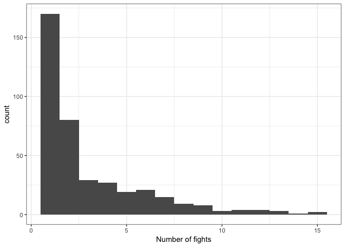
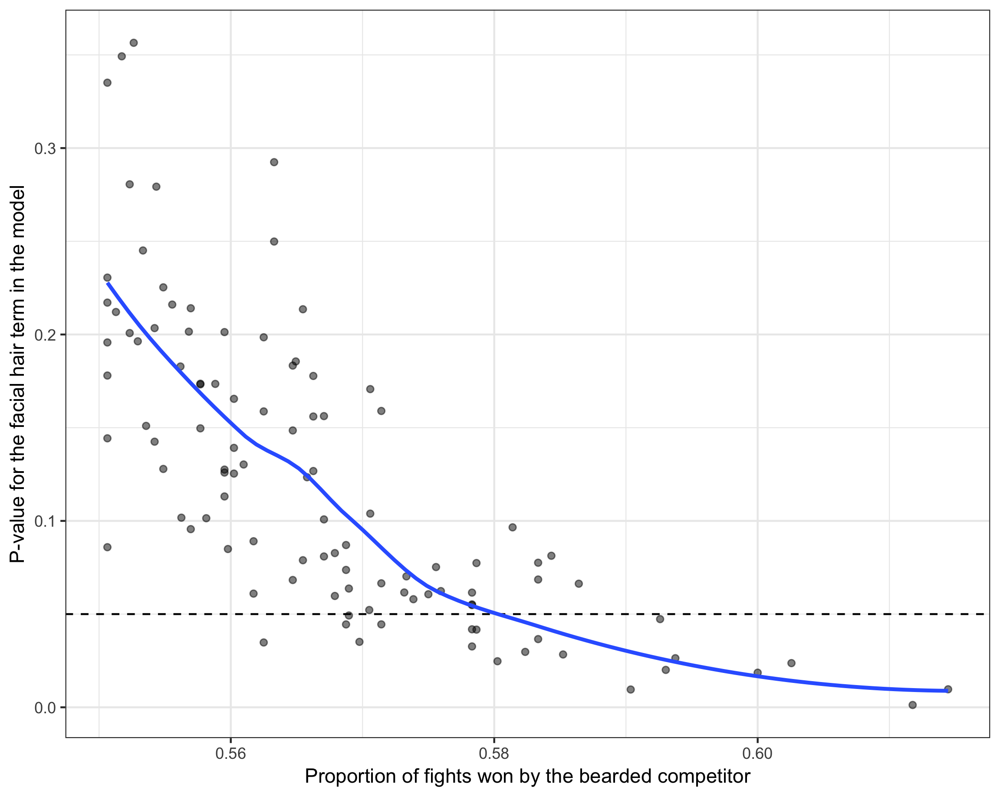
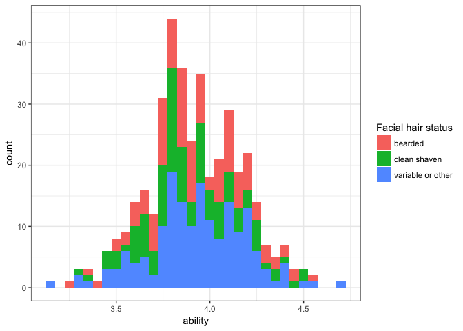

Beards in UFC
================

A Bradley-Terry analysis of the effect (or lack thereof) of beards on UFC wins, losses, and knock-outs.
=======================================================================================================

Preliminary setting up of the software and the data
---------------------------------------------------

First load the libraries that we are using. Install first from CRAN if necessary.

``` r
library(qvcalc)
library(BradleyTerry2)
library(dplyr)
library(magrittr)
library(knitr)
library(ggplot2)
source("R/functions_for_prepping_bt_analysis.R")
```

Then load the data.

``` r
winner <- read.csv("data/UFC_winner.csv", stringsAsFactors = FALSE)
loser <- read.csv("data/UFC_loser.csv", stringsAsFactors = FALSE)
predictors <- read.csv("data/UFC_predictors.csv", stringsAsFactors = FALSE)
```

Recode some of the very rare stance types to "other" also helps the model converge.

``` r
#winner <- winner[c(-18,-157),]
#loser <- loser[c(-18,-157),]
#predictors <- predictors[c(-6,-162),]
predictors$stance[predictors$stance==""] <- "other"
predictors$stance[predictors$stance=="Open Stance "] <- "other"
predictors$stance[predictors$stance=="Switch "] <- "other"
```

A table of counts of wins and losses for the particular facial hair combinations in the dataset

``` r
summary_df<-data_frame(facehair_winner=winner$facehair,facehair_loser=loser$facehair)
summary_df[summary_df=="1"]<-"clean-shaven"
summary_df[summary_df=="2"]<-"other facial hair"
summary_df[summary_df=="3"]<-"full beard"
kable(as.data.frame(table(summary_df)))
```

| facehair\_winner  | facehair\_loser   |  Freq|
|:------------------|:------------------|-----:|
| clean-shaven      | clean-shaven      |   117|
| full beard        | clean-shaven      |    41|
| other facial hair | clean-shaven      |    87|
| clean-shaven      | full beard        |    36|
| full beard        | full beard        |    23|
| other facial hair | full beard        |    41|
| clean-shaven      | other facial hair |    93|
| full beard        | other facial hair |    34|
| other facial hair | other facial hair |   128|

``` r
#table(summary_df)
```

Also the distribution of fights by each fighter is of interst. While

``` r
out<-data_frame(numberoffights=as.integer(table(cbind(winner$name,loser$name))))
ggplot(out,aes(x=numberoffights))+geom_histogram(binwidth=1)+theme_bw()+labs(x="Number of fights")
```



``` r
print(paste("median number of fights was",median(out$numberoffights)))
```

    ## [1] "median number of fights was 2"

``` r
print(paste("mean number of fights was",mean(out$numberoffights)))
```

    ## [1] "mean number of fights was 3.0379746835443"

Bradley Terry Analysis
----------------------

Turns out that the BradleyTerry model formation needs a very specific format to match things up so we label all the unique id columns "ID" and sort the predictor unique ID column to match the order of the levels of the trial-level files. This is all now done in an external function. If curious, investigate the R-script that is sourced at the top of this knitr document.

``` r
beards <- set_up_btm(predictors, winner, loser)
```

### Model 1: treating "other facial hair" as a seperate class

Run the model.

``` r
model1<-BTm(player1=winner,player2=loser,
            formula = ~ prev + facehair + ht[ID] + reach[ID] + stance[ID] +
              (1|ID), id="ID",data=beards)

summary(model1)
```

    ## 
    ## Call:
    ## BTm(player1 = winner, player2 = loser, formula = ~prev + facehair + 
    ##     ht[ID] + reach[ID] + stance[ID] + (1 | ID), id = "ID", data = beards)
    ## 
    ## Fixed Effects:
    ##                     Estimate Std. Error z value Pr(>|z|)   
    ## prev                 0.11473    0.14755   0.778  0.43684   
    ## facehair2           -0.04126    0.15227  -0.271  0.78642   
    ## facehair3           -0.06093    0.20418  -0.298  0.76540   
    ## ht[ID]              -0.04807    0.05217  -0.921  0.35686   
    ## reach[ID]            0.09429    0.03637   2.592  0.00953 **
    ## stance[ID]other     -1.08072    0.42659  -2.533  0.01130 * 
    ## stance[ID]Southpaw   0.23955    0.16547   1.448  0.14770   
    ## ---
    ## Signif. codes:  0 '***' 0.001 '**' 0.01 '*' 0.05 '.' 0.1 ' ' 1
    ## 
    ## (Dispersion parameter for binomial family taken to be 1)
    ## 
    ## Random Effects:
    ##           Estimate Std. Error z value Pr(>|z|)    
    ## Std. Dev.   0.4879     0.1031   4.732 2.22e-06 ***
    ## ---
    ## Signif. codes:  0 '***' 0.001 '**' 0.01 '*' 0.05 '.' 0.1 ' ' 1
    ## 
    ## Number of iterations: 15

### Model 2: treating "other facial hair" as a clean shaven

``` r
winner2<-winner
loser2<-loser
winner2$facehair[winner2$facehair==2]<-1
loser2$facehair[loser2$facehair==2]<-1
beards2 <- set_up_btm(predictors, winner2, loser2)
model2<-BTm(player1=winner,player2=loser,
            formula = ~ prev + facehair + ht[ID] + reach[ID] + stance[ID] +
              (1|ID), id="ID",data=beards2)
summary(model2)
```

    ## 
    ## Call:
    ## BTm(player1 = winner, player2 = loser, formula = ~prev + facehair + 
    ##     ht[ID] + reach[ID] + stance[ID] + (1 | ID), id = "ID", data = beards2)
    ## 
    ## Fixed Effects:
    ##                     Estimate Std. Error z value Pr(>|z|)   
    ## prev                 0.11654    0.14737   0.791  0.42907   
    ## facehair3           -0.03888    0.18645  -0.209  0.83481   
    ## ht[ID]              -0.04723    0.05195  -0.909  0.36326   
    ## reach[ID]            0.09374    0.03622   2.588  0.00966 **
    ## stance[ID]other     -1.07241    0.42500  -2.523  0.01163 * 
    ## stance[ID]Southpaw   0.24283    0.16445   1.477  0.13978   
    ## ---
    ## Signif. codes:  0 '***' 0.001 '**' 0.01 '*' 0.05 '.' 0.1 ' ' 1
    ## 
    ## (Dispersion parameter for binomial family taken to be 1)
    ## 
    ## Random Effects:
    ##           Estimate Std. Error z value Pr(>|z|)    
    ## Std. Dev.   0.4823     0.1033   4.669 3.03e-06 ***
    ## ---
    ## Signif. codes:  0 '***' 0.001 '**' 0.01 '*' 0.05 '.' 0.1 ' ' 1
    ## 
    ## Number of iterations: 15

### Power analysis of this result: how many more fights would bearded fighters would've needed to win to get a significant result

Not running this dynamically, because the current version of the figure takes about an hour of computation time on a normal computer.

 The observed proportion of wins by bearded competitors was 49.3 % . We would have detected a significant effect at 58 % (on average) suggesting that that our method and sample size had sufficient power to detect a reasonable sized competitive advantage--if it had existed.

The fact that at this sample size the proportion of victories by bearded competitors is so close to 50% suggests that any effect of beards on competitive outcomes, if it exists at all, is vanishing small.

Does this result depend on the type of victory?
-----------------------------------------------

2 or less is a TKO or KO. Greater than 3 is submission or decision or some other outcome. Here we split the dataset into those two categories and show that facial hair still does not have an effect.

### Model 3: only the fights that resulted in TKO's or KO's:

``` r
w1<-filter(winner,method<=2)
l1<-filter(loser,method<=2)
p1<-subset(predictors,predictors$ID%in%c(as.character(w1$ID),as.character(l1$ID)))
b.out<-set_up_btm(p1,w1,l1)

model3<-BTm(player1=winner,player2=loser,
            formula = ~ prev + facehair + ht[ID] + reach[ID] + stance[ID] +
              (1|ID), id="ID",data=b.out)
summary(model3)
```

    ## 
    ## Call:
    ## BTm(player1 = winner, player2 = loser, formula = ~prev + facehair + 
    ##     ht[ID] + reach[ID] + stance[ID] + (1 | ID), id = "ID", data = b.out)
    ## 
    ## Fixed Effects:
    ##                     Estimate Std. Error z value Pr(>|z|)  
    ## prev                 0.16497    0.25873   0.638   0.5237  
    ## facehair2            0.21512    0.27353   0.786   0.4316  
    ## facehair3            0.60300    0.36363   1.658   0.0973 .
    ## ht[ID]              -0.11383    0.09475  -1.201   0.2296  
    ## reach[ID]            0.10135    0.06315   1.605   0.1085  
    ## stance[ID]other     -1.46829    0.83877  -1.751   0.0800 .
    ## stance[ID]Southpaw   0.47954    0.30645   1.565   0.1176  
    ## ---
    ## Signif. codes:  0 '***' 0.001 '**' 0.01 '*' 0.05 '.' 0.1 ' ' 1
    ## 
    ## (Dispersion parameter for binomial family taken to be 1)
    ## 
    ## Random Effects:
    ##           Estimate Std. Error z value Pr(>|z|)  
    ## Std. Dev.   0.5004     0.2065   2.423   0.0154 *
    ## ---
    ## Signif. codes:  0 '***' 0.001 '**' 0.01 '*' 0.05 '.' 0.1 ' ' 1
    ## 
    ## Number of iterations: 11

### Model 4: TKO's and KO's but now lumping the "other facial hair" in with clean shaven:

``` r
w1$facehair[w1$facehair==2]<-1
l1$facehair[l1$facehair==2]<-1

b.out<-set_up_btm(p1,w1,l1)


model4<-BTm(player1=winner,player2=loser,
            formula = ~ prev + facehair + ht[ID] + reach[ID] + stance[ID] +
              (1|ID), id="ID",data=b.out)
summary(model4)
```

    ## 
    ## Call:
    ## BTm(player1 = winner, player2 = loser, formula = ~prev + facehair + 
    ##     ht[ID] + reach[ID] + stance[ID] + (1 | ID), id = "ID", data = b.out)
    ## 
    ## Fixed Effects:
    ##                     Estimate Std. Error z value Pr(>|z|)  
    ## prev                 0.17335    0.25704   0.674   0.5000  
    ## facehair3            0.51136    0.34015   1.503   0.1328  
    ## ht[ID]              -0.11112    0.09358  -1.187   0.2350  
    ## reach[ID]            0.09859    0.06236   1.581   0.1139  
    ## stance[ID]other     -1.44372    0.83143  -1.736   0.0825 .
    ## stance[ID]Southpaw   0.44332    0.29893   1.483   0.1381  
    ## ---
    ## Signif. codes:  0 '***' 0.001 '**' 0.01 '*' 0.05 '.' 0.1 ' ' 1
    ## 
    ## (Dispersion parameter for binomial family taken to be 1)
    ## 
    ## Random Effects:
    ##           Estimate Std. Error z value Pr(>|z|)  
    ## Std. Dev.   0.4688     0.2131     2.2   0.0278 *
    ## ---
    ## Signif. codes:  0 '***' 0.001 '**' 0.01 '*' 0.05 '.' 0.1 ' ' 1
    ## 
    ## Number of iterations: 10

Extracting BT Abilities for graphics
------------------------------------

Examine a histogram using a simplified version of the model and a work around because of the bug in the BTabilities function. This led to [a StackOverflow question](https://stackoverflow.com/questions/30253178/calculate-bradleyterry-ability-rankings) and eventually a resolution via the original writers of the package.

``` r
model.graphics<-BTm(player1=winner,player2=loser,
                    formula = ~ prev + facehair  + ht[ID] + reach[ID]  +
                      (1|ID), id="ID",data=beards)

summary(model.graphics)
```

    ## 
    ## Call:
    ## BTm(player1 = winner, player2 = loser, formula = ~prev + facehair + 
    ##     ht[ID] + reach[ID] + (1 | ID), id = "ID", data = beards)
    ## 
    ## Fixed Effects:
    ##           Estimate Std. Error z value Pr(>|z|)  
    ## prev       0.12552    0.14604   0.860   0.3900  
    ## facehair2 -0.03241    0.14999  -0.216   0.8289  
    ## facehair3 -0.04466    0.19984  -0.223   0.8232  
    ## ht[ID]    -0.03568    0.05136  -0.695   0.4872  
    ## reach[ID]  0.08841    0.03581   2.469   0.0136 *
    ## ---
    ## Signif. codes:  0 '***' 0.001 '**' 0.01 '*' 0.05 '.' 0.1 ' ' 1
    ## 
    ## (Dispersion parameter for binomial family taken to be 1)
    ## 
    ## Random Effects:
    ##           Estimate Std. Error z value Pr(>|z|)    
    ## Std. Dev.   0.4771     0.1022   4.667 3.06e-06 ***
    ## ---
    ## Signif. codes:  0 '***' 0.001 '**' 0.01 '*' 0.05 '.' 0.1 ' ' 1
    ## 
    ## Number of iterations: 15

``` r
out<-get_bt_abilities(model.graphics,predictors)
predictors$ability<-out$abilities
all<-rbind(winner,loser)
all$winning<-c(rep("yes",length(winner$ID)),rep("no",length(winner$ID)))
all$ID<-as.factor(all$ID)
winner2<-filter(all,winning=="yes")
loser2<-filter(all,winning=="no")
beardy<-summarize(group_by(all,name),mean(facehair))
predictors$beardy<-beardy$`mean(facehair)`[match(predictors$name,beardy$name)]
all$winning[all$winning=="yes"]<-"win"
all$winning[all$winning=="no"]<-"loss"
all$finish[all$method>2]<-"other"
all$finish[all$method<=2]<-"knockout"
all$outcome<-paste(all$winning,all$finish,sep="_")
prop.ko<-summarize(group_by(all,name),prop_knocked=sum(outcome=="loss_knockout")/length(finish))

predictors$beardy[predictors$beardy==1]<-"clean shaven"
predictors$beardy[predictors$beardy==2]<-"bearded"
predictors$beardy[!predictors$beardy%in%c("clean shaven","bearded")]<-"variable or other"
table(predictors$beardy)
```

    ## 
    ##           bearded      clean shaven variable or other 
    ##               115               111               169

``` r
ggplot(predictors,aes(x=ability, fill = beardy)) +
  geom_histogram(binwidth = 0.05)+theme_bw() + labs(fill='Facial hair status') 
```



``` r
ggsave("figures/plot_hist.pdf")
```

    ## Saving 7 x 5 in image

``` r
predictors$prop.ko<-prop.ko$prop_knocked[match(predictors$name,prop.ko$name)]


ggplot(predictors,aes(fill=beardy,x=prop.ko))+geom_histogram(binwidth = 0.02)+xlab("Proportion of fights lost by KO or TKO")+ylab("Number of fighters")+theme_bw() + labs(fill="Facial hair status") 
```


``` r
ggsave("figures/knockout_hist.pdf")
```

    ## Saving 7 x 5 in image
